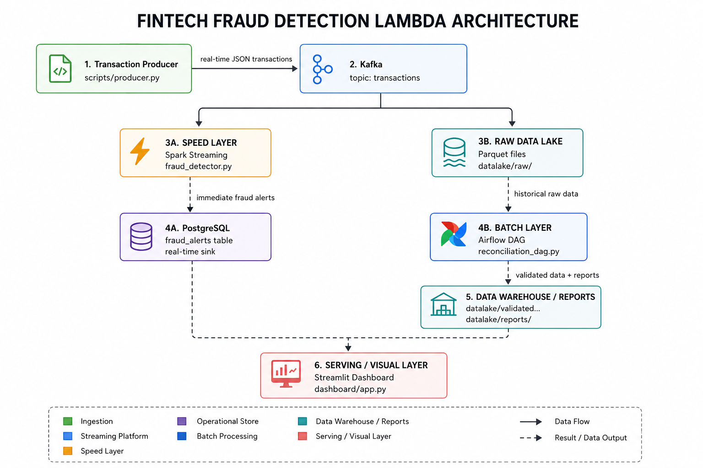

# FinTech Fraud Detection Pipeline

## Lambda Architecture for Real-Time Fraud Detection

This project implements a complete Lambda Architecture solution for detecting fraudulent transactions in a digital wallet system. It combines real-time stream processing with batch analytics for comprehensive fraud detection and reporting.


## 🏗️ Architecture Overview



## 🚨 Fraud Detection Rules

### 1. High Value Transactions
- **Rule**: Transaction amount > $5,000
- **Type**: `HIGH_VALUE`
- **Detection**: Immediate (stateless filter)

### 2. Impossible Travel
- **Rule**: Same user transacts from different countries within 10 minutes
- **Type**: `IMPOSSIBLE_TRAVEL`
- **Detection**: Windowed aggregation with state management

## 📁 Project Structure

```
FinTech/
├── docker-compose.yml           # Infrastructure definition
├── requirements.txt             # Python dependencies
├── README.md                    # This file
│
├── scripts/
│   ├── producer.py              # Transaction simulator
│   ├── fraud_detector.py        # Spark Streaming fraud detection
│   ├── Dockerfile.producer      # Producer container definition
│   └── submit_spark_job.sh      # Spark job submission script
│
├── airflow/
│   └── dags/
│       └── reconciliation_dag.py  # Batch processing DAG
│
├── postgres-init/
│   └── 01_init_fraud_db.sql     # Database initialization
│
├── datalake/
│   ├── raw/                     # Raw transaction Parquet files
│   ├── validated_transactions/  # Warehouse for clean data
│   └── reports/                 # Generated reports
│
└── spark/
    └── jars/                    # Additional Spark JARs (if needed)
```

## 🚀 Quick Start

### Prerequisites
- Docker & Docker Compose
- At least 8GB RAM available
- Ports available: 9092, 8080, 8081, 8082, 5432, 2181

### Step 1: Start the Infrastructure

```bash
# Navigate to project directory
cd /home/dushmin/FinTech

# Start all services
docker-compose up -d

# Check service status
docker-compose ps
```

### Step 2: Wait for Services to Initialize

```bash
# Wait for Kafka to be ready (check logs)
docker-compose logs -f kafka

# Wait for Airflow to complete initialization
docker-compose logs -f airflow-init
```

### Step 3: Verify Services

| Service | URL | Credentials |
|---------|-----|-------------|
| Spark Master UI | http://localhost:8080 | - |
| Spark Worker UI | http://localhost:8081 | - |
| Airflow UI | http://localhost:8082 | admin / admin |
| PostgreSQL | localhost:5432 | fintech / fintech123 |

### Step 4: Start the Fraud Detection Pipeline

```bash
# Start the Spark Streaming job
chmod +x scripts/submit_spark_job.sh
./scripts/submit_spark_job.sh

# Or manually submit:
docker exec spark-master spark-submit \
    --master spark://spark-master:7077 \
    --packages org.apache.spark:spark-sql-kafka-0-10_2.12:3.5.0,org.postgresql:postgresql:42.6.0 \
    /opt/spark-scripts/fraud_detector.py
```

### Step 5: The Producer Starts Automatically

The producer container starts automatically and begins generating transactions.

Check producer logs:
```bash
docker-compose logs -f producer
```

### Step 6: Monitor Fraud Alerts

```bash
# Connect to PostgreSQL and query fraud alerts
docker exec -it postgres psql -U fintech -d fraud_db

# Query fraud alerts
SELECT * FROM fraud_alerts ORDER BY detected_at DESC LIMIT 10;

# View statistics
SELECT * FROM fraud_statistics;

# View daily summary
SELECT * FROM daily_fraud_summary;
```

### Step 7: Trigger Airflow DAG (Optional)

The DAG runs automatically every 6 hours, but you can trigger it manually:

1. Open Airflow UI: http://localhost:8082
2. Login: admin / admin
3. Find DAG: `fintech_fraud_reconciliation`
4. Click "Trigger DAG"

## 📊 Output Examples

### Fraud Alert (PostgreSQL)
```
id | transaction_id | user_id | fraud_type | amount | detected_at
---|----------------|---------|------------|--------|------------
1  | abc-123...     | USER_01 | HIGH_VALUE | 7500.00| 2024-01-15 10:30:00
```

### Reconciliation Report
```
================================================================================
                    RECONCILIATION REPORT
================================================================================

VOLUME ANALYSIS
---------------
Total Transactions Processed:     10,000
Validated Transactions:           9,500
Fraud Transactions Blocked:       500
Fraud Rate:                       5.00%

AMOUNT ANALYSIS
---------------
Total Ingress Amount:            $1,250,000.00
Validated Amount:                $1,100,000.00
Fraudulent Amount Blocked:       $150,000.00
```

## ⏱️ Event Time Handling

The Spark Streaming job uses **Event Time** semantics, crucial for accurate fraud detection:

1. **Timestamp Parsing**: Transaction `timestamp` field is used as event time
2. **Watermarking**: 10-minute watermark handles late-arriving data
3. **Windowed Processing**: 10-minute tumbling windows for impossible travel detection
4. **State Management**: Automatic state cleanup based on watermark

See detailed comments in `fraud_detector.py` for implementation details.

## 🛑 Stopping the Pipeline

```bash
# Stop all services
docker-compose down

# Stop and remove volumes (clean slate)
docker-compose down -v

# Stop specific service
docker-compose stop producer
```

## 🔧 Configuration

### Environment Variables

| Variable | Default | Description |
|----------|---------|-------------|
| `KAFKA_BOOTSTRAP_SERVERS` | `kafka:29092` | Kafka broker address |
| `KAFKA_TOPIC` | `transactions` | Transaction topic name |
| `POSTGRES_HOST` | `postgres` | PostgreSQL host |
| `POSTGRES_DB` | `fraud_db` | Database name |

### Adjustable Parameters

In `producer.py`:
- `FRAUD_PROBABILITY`: Chance of generating fraud (default: 10%)
- `HIGH_VALUE_FRAUD_PROBABILITY`: High value vs impossible travel ratio

In `fraud_detector.py`:
- `HIGH_VALUE_THRESHOLD`: Dollar amount threshold (default: $5000)
- `IMPOSSIBLE_TRAVEL_WINDOW`: Detection window (default: 10 min)
- `WATERMARK_DELAY`: Late data tolerance (default: 10 min)

## 📈 Scaling Considerations

- Add more Spark workers by scaling `spark-worker` service
- Increase Kafka partitions for higher throughput
- Use Kafka consumer groups for parallel processing
- Consider using Apache Flink for lower latency requirements

## 🐛 Troubleshooting

### Kafka Connection Issues
```bash
# Check if Kafka is ready
docker exec kafka kafka-topics --bootstrap-server localhost:9092 --list
```

### Spark Job Fails
```bash
# Check Spark master logs
docker-compose logs spark-master

# Verify packages are downloaded
docker exec spark-master ls /root/.ivy2/cache/
```

### Airflow DAG Not Visible
```bash
# Restart scheduler
docker-compose restart airflow-scheduler

# Check DAG file syntax
docker exec airflow-webserver python -c "import sys; exec(open('/opt/airflow/dags/reconciliation_dag.py').read())"
```

## 📝 License

This project is for educational purposes as part of the Applied Big Data Engineering course.

## 👥 Team

FinTech Fraud Detection Team - University Mini Project
